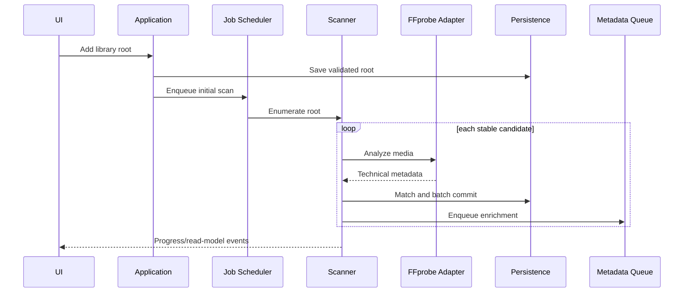
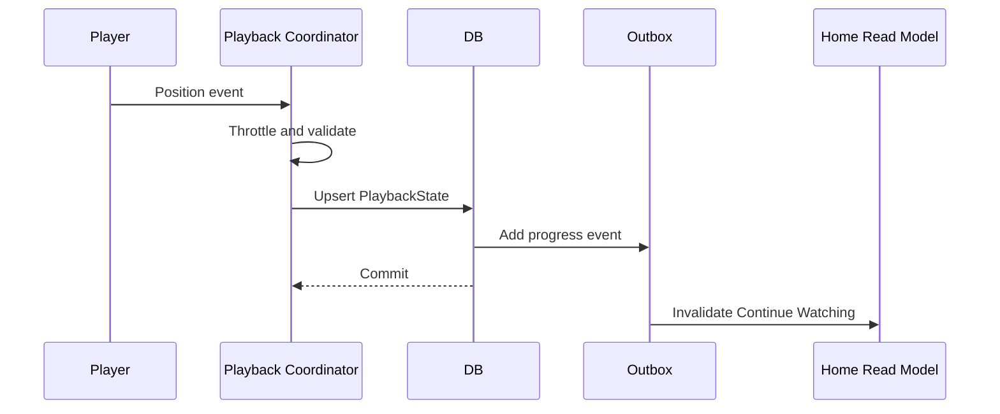
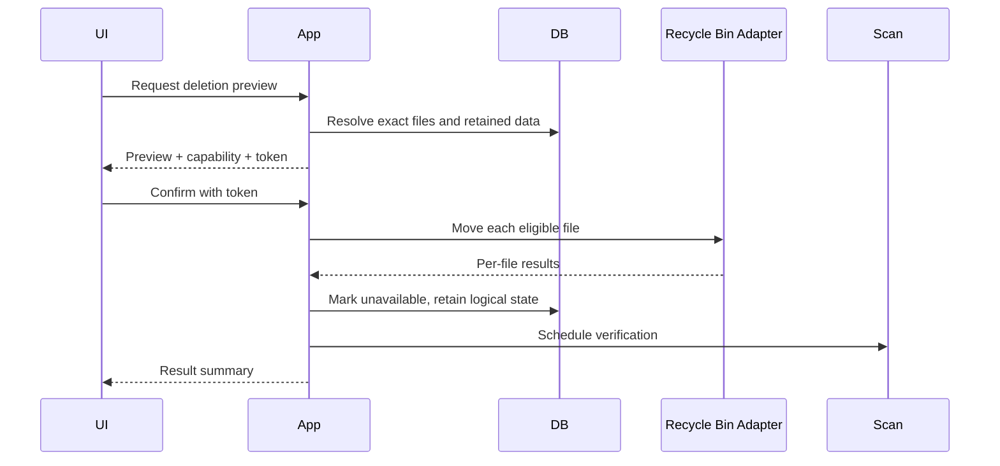
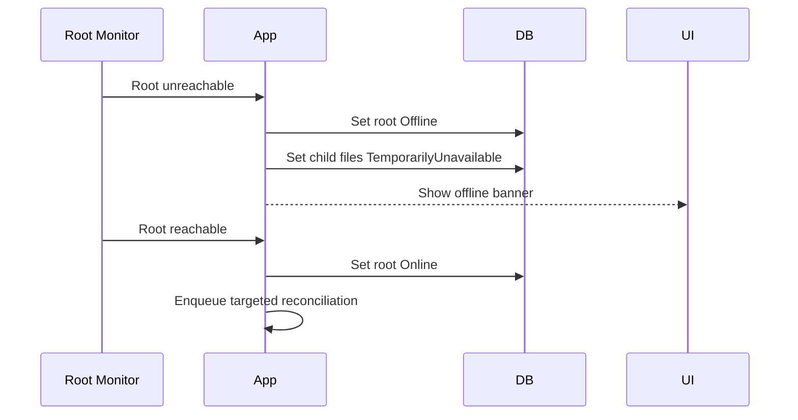
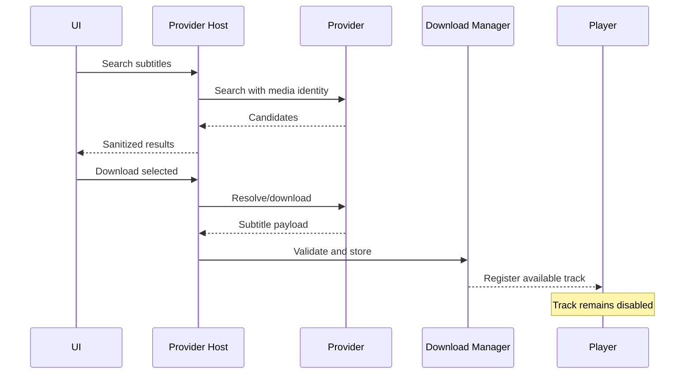
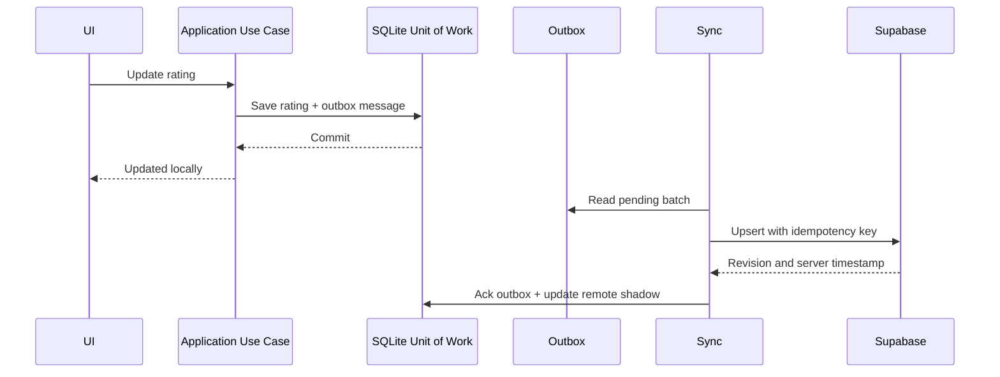
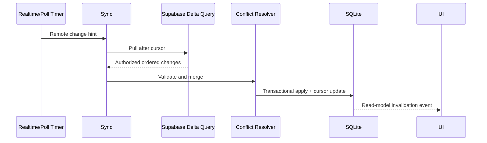

# Volume 21 — API Contracts, Events and Sequence Flows

**Project:** MediaHub  
**Document set:** MediaHub Project Bible  
**Status:** Revised baseline specification v1.2  
**Language:** English  
**Target platform:** Windows desktop first  
**Last updated:** 2026-08-08  

---

## 1. Contract philosophy

Contracts are small, versioned, cancellation-aware, and independent from UI frameworks and persistence implementations. DTOs do not expose mutable domain entities.

## 2. Library application contracts

```csharp
public interface ILibraryService
{
    Task<LibraryRootDto> AddRootAsync(
        AddLibraryRootRequest request,
        CancellationToken cancellationToken);

    Task RemoveRootAsync(
        Guid rootId,
        RemoveLibraryRootOptions options,
        CancellationToken cancellationToken);

    Task<BackgroundJobDto> ScanAsync(
        ScanLibraryRequest request,
        CancellationToken cancellationToken);

    Task<IReadOnlyList<ReviewCandidateDto>> GetReviewQueueAsync(
        ReviewQueueQuery query,
        CancellationToken cancellationToken);
}
```

## 3. Playback contracts

```csharp
public sealed record StartPlaybackRequest(
    Guid PlayableItemId,
    Guid? PreferredMediaFileId,
    PlaybackStartMode StartMode,
    PlaybackOriginContext? OriginContext);

public enum PlaybackStartMode
{
    Resume,
    FromBeginning,
    AtPosition
}

public sealed record PlaybackOriginContext(
    PlaybackOriginType Type,
    Guid? PlaylistId,
    Guid? PlaylistEntryId);
```

When `OriginContext.Type` is Playlist, continuation resolves the next playlist entry and never substitutes a canonical episode, sequel, or franchise item.

```csharp
public interface IPlaybackCoordinator
{
    Task<PlaybackSessionDto> StartAsync(
        StartPlaybackRequest request,
        CancellationToken cancellationToken);

    Task SaveCheckpointAsync(
        PlaybackCheckpoint checkpoint,
        CancellationToken cancellationToken);

    Task CompleteAsync(
        CompletePlaybackSessionRequest request,
        CancellationToken cancellationToken);
}
```

## 4. Deletion contracts

```csharp
public sealed record DeleteMediaRequest(
    IReadOnlyList<Guid> MediaFileIds,
    bool PreserveLogicalRecords = true);

public sealed record DeleteMediaPreview(
    IReadOnlyList<DeleteMediaFilePreview> Files,
    DeletionCapability Capability,
    IReadOnlyList<string> RetainedDataCategories,
    IReadOnlyList<string> Warnings);
```

Deletion is a two-step preview and execute workflow. The execute command includes a preview token to prevent stale or substituted file lists.

## 5. Search contracts

```csharp
public sealed record LibrarySearchQuery(
    string Text,
    IReadOnlyList<MediaType> MediaTypes,
    SearchFilters Filters,
    SortDefinition Sort,
    int Offset,
    int Limit);
```

Results include highlights, availability, progress, artwork reference, and reason for matching.

## 6. Provider contracts

Provider requests use opaque IDs and narrow context. The host does not pass the domain repository.

```csharp
public sealed record ProviderContext(
    string UiLocale,
    IReadOnlyList<string> MetadataLanguages,
    string CorrelationId,
    IProviderHttpClient Http,
    IProviderCache Cache,
    IProviderLogger Logger);
```

## 7. Domain events

### Media file events

```csharp
public sealed record MediaFileDiscovered(
    Guid MediaFileId,
    Guid LibraryRootId,
    DateTimeOffset DiscoveredAtUtc) : IDomainEvent;
```

```csharp
public sealed record MediaFileAvailabilityChanged(
    Guid MediaFileId,
    MediaFileAvailability Previous,
    MediaFileAvailability Current,
    DateTimeOffset ChangedAtUtc) : IDomainEvent;
```

### Playback events

```csharp
public sealed record PlayableItemCompleted(
    Guid PlayableItemId,
    Guid PlaybackSessionId,
    CompletionReason Reason,
    DateTimeOffset CompletedAtUtc) : IDomainEvent;
```

### Metadata events

```csharp
public sealed record NewEpisodeKnown(
    Guid SeriesId,
    Guid EpisodeId,
    DateTimeOffset OfficialAirDateUtc,
    string ProviderReleaseState,
    DateTimeOffset DetectedAtUtc) : IDomainEvent;
```

Notification generation requires the official air date to have arrived and a validated provider state of Released/Available. Local file availability is maintained by a separate media-file event.

### Multi-episode mapping contract

```csharp
public sealed record MediaFileEpisodeSegmentDto(
    Guid MediaFileId,
    Guid EpisodeId,
    int RangeOrder,
    TimeSpan? Start,
    TimeSpan? End,
    SegmentBoundarySource BoundarySource,
    decimal Confidence);
```

Unknown boundaries are valid and cause combined-range playback rather than guessed individual progress.

## 8. Outbox

Events that must survive process termination are persisted to `OutboxMessages` within the same transaction. Dispatcher marks them processed after idempotent handlers finish.

Outbox consumers include:

- read-model invalidation;
- notification generation;
- recommendation profile update;
- statistics update;
- scanner follow-up;
- synchronization outbox dispatch and remote read-model invalidation.

## 9. Sequence: initial scan



## 10. Sequence: playback checkpoint



## 11. Sequence: delete to Recycle Bin



## 12. Sequence: network root outage



## 13. Post-1.0 sequence: subtitle download



## 14. Idempotency

Commands requiring idempotency:

- scanner candidate commit;
- progress checkpoint;
- outbox processing;
- provider cache write;
- download completion import;
- update notification;
- new episode notification.

Idempotency keys use stable operation IDs and domain identifiers.

## 15. API error envelope

```csharp
public sealed record ApplicationError(
    string Code,
    ErrorCategory Category,
    string UserMessageKey,
    IReadOnlyDictionary<string, string> MessageArguments,
    string? CorrelationId,
    bool IsRetryable);
```

Internal exceptions are not serialized into plugin or UI contracts.

## 16. Schema evolution

JSON and plugin contracts include schema version. Readers:

- reject unsupported major version;
- ignore unknown optional fields;
- preserve required validation;
- log compatibility event;
- provide migration guidance.

## 17. Cancellation

Cancellation is honored between safe units. Operations that entered an atomic commit finish or rollback. UI cancellation does not terminate the process or leave partial database state.

## 18. Acceptance criteria

- Contracts do not expose EF entities.
- Delete execution cannot alter file list after preview token.
- Outbox events survive restart.
- Provider receives only narrow host services.
- Sequence flows preserve local operation during provider or network failure.
- Cancellation leaves committed batches consistent.


## 19. Cloud abstraction contracts

These contracts are active in Development/Test builds in 1.0 and are reserved for the later public synchronization feature. Public Windows 1.0 does not expose `SignInAsync` or personal-sync UI.

```csharp
public interface ICloudIdentityService
{
    Task<CloudIdentityState> GetStateAsync(CancellationToken cancellationToken);
    Task SignInAsync(CloudSignInRequest request, CancellationToken cancellationToken);
    Task SignOutAsync(CancellationToken cancellationToken);
}

public interface ICloudSyncService
{
    Task<SyncRunResult> SynchronizeAsync(
        SyncReason reason,
        CancellationToken cancellationToken);

    Task<SyncStatusDto> GetStatusAsync(CancellationToken cancellationToken);
}

public interface IRemoteConfigurationService
{
    Task<RemoteConfigurationSnapshot> RefreshAsync(
        CancellationToken cancellationToken);
}
```

No contract returns Supabase SDK models.

## 20. Local edit push sequence



## 21. Remote delta pull sequence



---

## Document control

This document is part of the MediaHub revised baseline specification v1.2. Changes that affect architecture, security, data compatibility, plugin contracts, or user-visible behavior must be recorded in the Architecture Decision Record volume and reflected in the traceability matrix.
